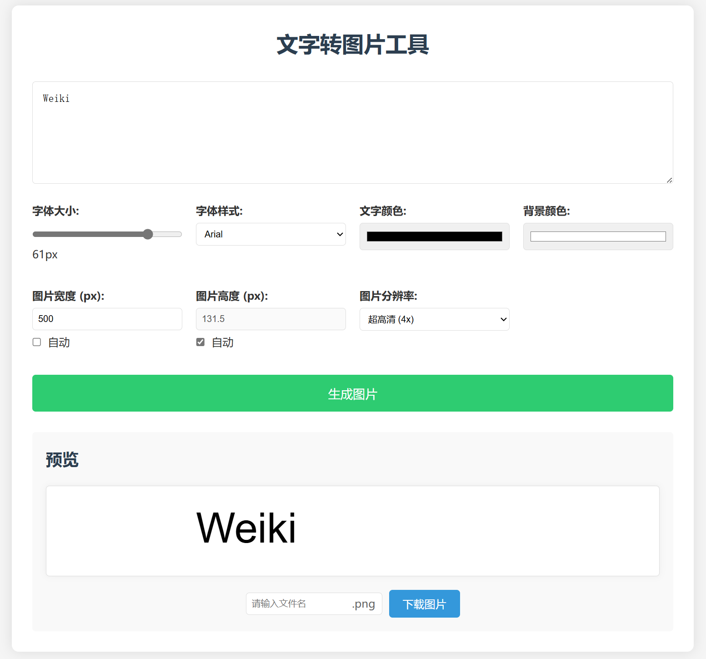

# 文字转图片应用 / Text-to-Image Application

一个简单而强大的网页应用，可以将文字转换为自定义图片。

*A simple yet powerful web application that converts text to customizable images.*



## 功能特点 / Features

- ✨ 将文本转换为高质量图片 / Convert text to high-quality images
- 🎨 自定义字体大小、样式和颜色 / Customize font size, style, and color 
- 🖼️ 自定义背景颜色 / Customize background color
- 📏 自定义图片尺寸 / Customize image dimensions
- 🔍 多种输出分辨率选项 / Multiple output resolution options
- 💾 自定义文件名保存 / Save with custom filenames

## 使用方法 / How to Use

### 中文说明

1. 在文本框中输入要转换的文字
2. 使用控制面板调整以下参数:
   - 字体大小
   - 字体样式
   - 文字颜色
   - 背景颜色
   - 图片宽度和高度 (可选择自动或手动设置)
   - 输出分辨率 (标准、高清或超高清)
3. 点击"生成图片"按钮预览效果
4. 输入想要的文件名(可选)
5. 点击"下载图片"按钮保存为PNG格式

### English Instructions

1. Enter the text you want to convert in the text box
2. Use the control panel to adjust the following parameters:
   - Font size
   - Font style
   - Text color
   - Background color
   - Image width and height (automatic or manual)
   - Output resolution (standard, HD, or ultra HD)
3. Click the "Generate Image" button to preview
4. Enter a desired filename (optional)
5. Click the "Download Image" button to save as PNG

## 启动方法 / How to Run

### 方法1: 直接打开HTML文件 / Method 1: Open HTML File Directly

直接用浏览器打开`index.html`文件即可使用该应用。

*Simply open the `index.html` file with your browser to use the application.*

### 方法2: 使用本地服务器 (推荐) / Method 2: Use Local Server (Recommended)

1. 确保已安装 [Node.js](https://nodejs.org/)  
   *Make sure [Node.js](https://nodejs.org/) is installed*

2. 在项目目录下打开命令行，执行以下命令:  
   *Open command line in the project directory and run:*

```bash
# 安装依赖 / Install dependencies
npm install

# 启动服务器 / Start server
npm start
```

3. 打开浏览器，访问 http://localhost:3000  
   *Open your browser and visit http://localhost:3000*

开发模式 (自动刷新) / Development mode (auto-refresh):

```bash
npm run dev
```

## 技术实现 / Technologies Used

- HTML5
- CSS3
- JavaScript (ES6+)
- Canvas API
- Node.js (用于本地服务器 / for local server)

## 浏览器兼容性 / Browser Compatibility

支持所有现代浏览器，包括:  
*Supports all modern browsers, including:*

- Chrome
- Firefox
- Safari
- Edge

## 贡献指南 / Contributing

欢迎贡献代码或提出建议。请随时创建拉取请求或开设问题。

*Contributions are welcome. Feel free to create pull requests or open issues.*

## 许可证 / License

MIT 